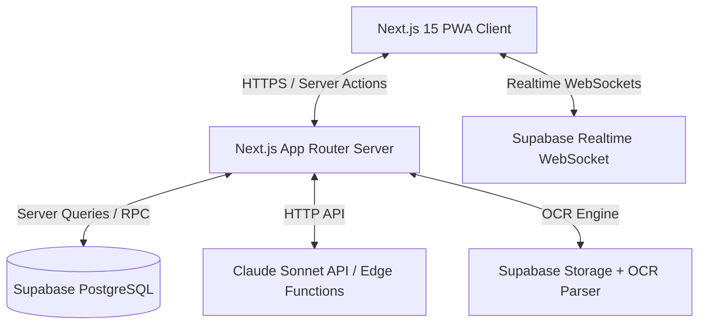

# Lumora AI — System Architecture

This document describes the architectural patterns, components, and data flow of Lumora AI.

## 1. System Topology Overview
Lumora AI is built on a decoupled, server-first modern stack.



---

## 2. Client Architecture (Frontend)
The frontend uses **Next.js 15 App Router** configured for React Server Components (RSC) and Client Components where interactivity is required.

### Directory Structure by Features
The codebase uses a **Feature-Based Architecture**. Code related to a specific domain (e.g., transactions, goals, budgets) is co-located:
```
src/
├── app/                  # Next.js App Router routing structure
├── features/             # Feature-based folders
│   ├── auth/             # Custom authentication screens & state
│   ├── transactions/     # Transaction list, details, forms, analytics
│   ├── budgets/          # Budget management & alerts
│   ├── goals/            # Savings goal tracking & AI estimation
│   ├── subscriptions/    # Subscriptions view & recurring logs
│   ├── chat/             # AI Financial Advisor conversational interface
│   └── dashboard/        # Overall financial health cards & flow
├── components/           # Reusable generic UI components (Buttons, Modals, Cards)
├── hooks/                # Global custom hooks (e.g., useMediaQuery, useLocalStorage)
├── actions/              # Shared server actions
├── services/             # API clients, supabase server clients, AI adapters
└── utils/                # Formatters, calculators, date functions
```

### State Management & Caching
* **Read-heavy Operations:** Handled via Next.js React Server Components directly querying the database, leveraging Next.js caching.
* **Write Operations / Mutations:** Server Actions with optimistic UI updates handled on the client via `useOptimistic` or TanStack Query.
* **Client Cache:** TanStack Query (React Query) controls client-side cache invalidation for dynamic interactions, ensuring instant client feedback.
* **Local State:** React context or simple `useState` for local UI state (e.g., drawer opening, search query).

---

## 3. Server & Database Architecture (Backend)
Supabase provides the core database and authentication backend:
* **Authentication:** Supabase Auth issues JWT tokens verified by Next.js Middleware.
* **Database:** PostgreSQL with Row Level Security (RLS) policies configured on every table to prevent cross-tenant access.
* **Realtime Sync:** Enables push notifications and instant synchronization across multiple devices.
* **Storage:** Bucket for storing uploaded receipts and transaction attachments, integrated with RLS.

---

## 4. AI Communication Pipeline
To control costs and maximize speed and accuracy, the AI co-pilot operates on a structured pipelines:
1. **Request:** User queries the AI chat client.
2. **Context Resolution:** The server translates the request context into optimized PostgreSQL queries (e.g., summing spending in the current month).
3. **Execution:** Database returns structured JSON aggregates.
4. **LLM Synthesis:** The structured JSON, along with user behavioral history and prompt instructions, is passed to Claude Sonnet.
5. **Response:** Claude compiles the data into human-like financial advice.
