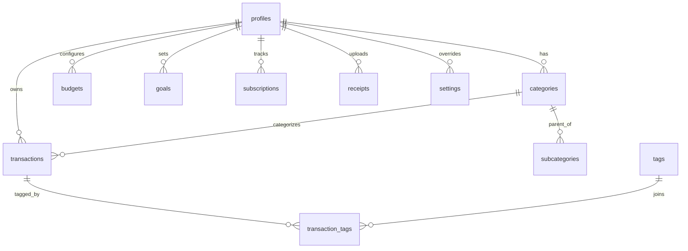

# Lumora AI — Database Architecture

This document defines the schema, relations, Row-Level Security (RLS) policies, indexes, and triggers for the Lumora AI PostgreSQL database.

---

## 1. Entity-Relationship Diagram Core Structure
All tables use UUIDs for primary keys (`gen_random_uuid()`) and reference the central `profiles` table, which matches Supabase Auth's user database.



---

## 2. Table Definitions & SQL Schemas

Below are the key tables defined for Supabase PostgreSQL.

### profiles
Stores demographic details linked to Supabase Auth (`auth.users`).
```sql
CREATE TABLE public.profiles (
    id UUID PRIMARY KEY REFERENCES auth.users(id) ON DELETE CASCADE,
    email TEXT UNIQUE NOT NULL,
    display_name TEXT,
    avatar_url TEXT,
    created_at TIMESTAMP WITH TIME ZONE DEFAULT CURRENT_TIMESTAMP NOT NULL,
    updated_at TIMESTAMP WITH TIME ZONE DEFAULT CURRENT_TIMESTAMP NOT NULL
);
```

### categories & subcategories
Standard categorization tables with system defaults (`is_system = true`) and custom user categories.
```sql
CREATE TABLE public.categories (
    id UUID PRIMARY KEY DEFAULT gen_random_uuid(),
    user_id UUID REFERENCES public.profiles(id) ON DELETE CASCADE, -- NULL for system defaults
    name TEXT NOT NULL,
    type VARCHAR(20) CHECK (type IN ('income', 'expense', 'transfer')) NOT NULL,
    icon TEXT,
    color VARCHAR(10),
    is_system BOOLEAN DEFAULT false NOT NULL,
    created_at TIMESTAMP WITH TIME ZONE DEFAULT CURRENT_TIMESTAMP NOT NULL,
    UNIQUE (user_id, name)
);

CREATE TABLE public.subcategories (
    id UUID PRIMARY KEY DEFAULT gen_random_uuid(),
    category_id UUID REFERENCES public.categories(id) ON DELETE CASCADE NOT NULL,
    user_id UUID REFERENCES public.profiles(id) ON DELETE CASCADE, -- NULL for system defaults
    name TEXT NOT NULL,
    created_at TIMESTAMP WITH TIME ZONE DEFAULT CURRENT_TIMESTAMP NOT NULL,
    UNIQUE (category_id, user_id, name)
);
```

### transactions
Main transaction ledger featuring mood indices for behavioral finance.
```sql
CREATE TABLE public.transactions (
    id UUID PRIMARY KEY DEFAULT gen_random_uuid(),
    user_id UUID REFERENCES public.profiles(id) ON DELETE CASCADE NOT NULL,
    type VARCHAR(20) CHECK (type IN ('income', 'expense', 'transfer')) NOT NULL,
    amount NUMERIC(12, 2) NOT NULL,
    currency VARCHAR(3) DEFAULT 'USD' NOT NULL,
    category_id UUID REFERENCES public.categories(id) ON DELETE RESTRICT NOT NULL,
    subcategory_id UUID REFERENCES public.subcategories(id) ON DELETE SET NULL,
    merchant_id UUID REFERENCES public.merchants(id) ON DELETE SET NULL,
    payment_method_id UUID REFERENCES public.payment_methods(id) ON DELETE SET NULL,
    date DATE DEFAULT CURRENT_DATE NOT NULL,
    time TIME,
    notes TEXT,
    mood VARCHAR(20) CHECK (mood IN ('happy', 'stressed', 'neutral', 'regretful', 'necessary')),
    source VARCHAR(20) DEFAULT 'manual' CHECK (source IN ('manual', 'import', 'ocr', 'api')),
    receipt_id UUID REFERENCES public.receipts(id) ON DELETE SET NULL,
    recurring_id UUID,
    created_at TIMESTAMP WITH TIME ZONE DEFAULT CURRENT_TIMESTAMP NOT NULL,
    updated_at TIMESTAMP WITH TIME ZONE DEFAULT CURRENT_TIMESTAMP NOT NULL,
    deleted_at TIMESTAMP WITH TIME ZONE
);
```

### Additional System Tables
The schema includes:
* **merchants / payment_methods:** Standardized payment and merchant naming.
* **budgets / budget_history:** Setting target spending boundaries and capturing historical rolling calculations.
* **goals / goal_progress:** Saving goals with granular targets.
* **subscriptions:** Auto-renewing records.
* **receipts:** Metadata tracking uploaded PDFs and images, with raw OCR data structures.
* **chat_history:** Logging conversation with Claude.
* **ai_reports / predictions:** Saved machine learning outputs and monthly reviews.
* **settings:** App-wide display configuration.
* **activity_logs:** Audit trail.

---

## 3. Performance & Indexing Strategy
To ensure maximum speed, indexes are applied to foreign keys and fields filtered heavily during summaries:
```sql
CREATE INDEX idx_transactions_user_date ON public.transactions(user_id, date DESC) WHERE deleted_at IS NULL;
CREATE INDEX idx_transactions_category ON public.transactions(category_id) WHERE deleted_at IS NULL;
CREATE INDEX idx_budget_user ON public.budgets(user_id);
CREATE INDEX idx_subscriptions_next_bill ON public.subscriptions(user_id, next_billing_date);
```

---

## 4. Row-Level Security (RLS) Policies
RLS is enabled on **all** tables. Below is the structure applied to the `transactions` table:
```sql
ALTER TABLE public.transactions ENABLE ROW LEVEL SECURITY;

CREATE POLICY "Users can only view their own transactions"
    ON public.transactions FOR SELECT
    USING (auth.uid() = user_id);

CREATE POLICY "Users can only insert their own transactions"
    ON public.transactions FOR INSERT
    WITH CHECK (auth.uid() = user_id);

CREATE POLICY "Users can only update their own transactions"
    ON public.transactions FOR UPDATE
    USING (auth.uid() = user_id)
    WITH CHECK (auth.uid() = user_id);
```

---

## 5. Automation Triggers
Every table possesses a trigger to sync the `updated_at` column:
```sql
CREATE OR REPLACE FUNCTION update_modified_column()
RETURNS TRIGGER AS $$
BEGIN
    NEW.updated_at = now();
    RETURN NEW;
END;
$$ language 'plpgsql';

CREATE TRIGGER update_profiles_modtime
    BEFORE UPDATE ON public.profiles
    FOR EACH ROW EXECUTE PROCEDURE update_modified_column();
```
Budget history rollover triggers compute spent aggregates at period termination.
